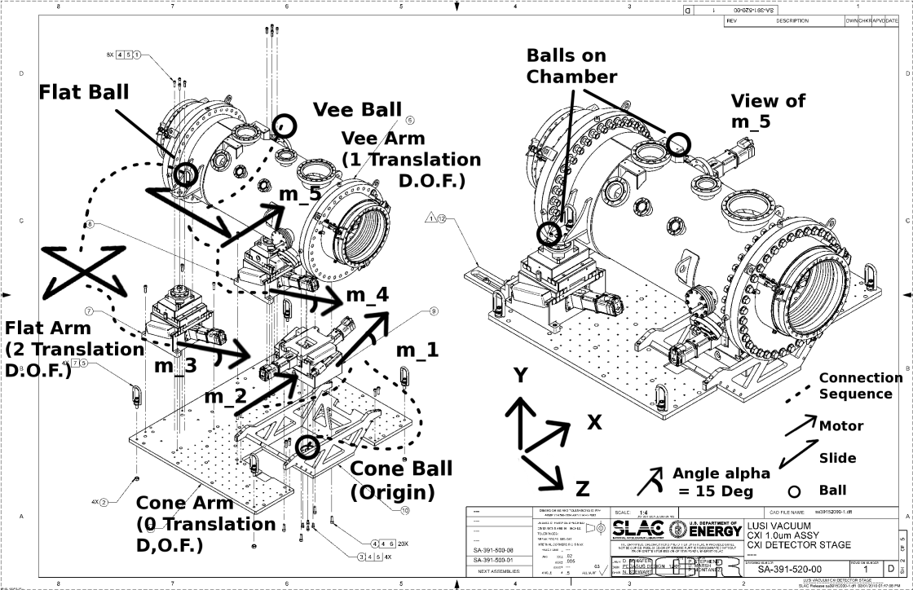
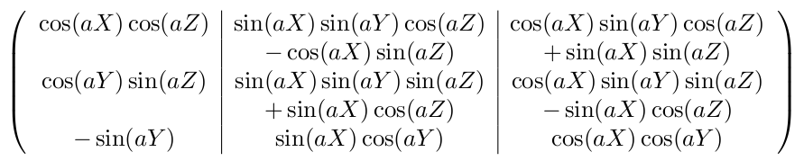

CXI Detector Rotation
=====================

.. include:: ../../README.rst

Overview
========
The detector stand consists of three external joints; cone, flat, and vee.
Each manipulates a separate corner of the stand capable of influencing the
position and rotation of the contained detector. Each joint has stages with
angles offset the traditional X,Y, and Z axes. For instance both the vee and
flat stages have a ``lift`` motor that can raise and lower the joints but also
introduce a parasitic motion forward in Z. This means that purely raising the
detector takes a coordinated effort between all three joints if you don't
want to introduce rotation.

The :ref:`joints` module handles the first level of manipulation, providing an
interface where you can request simple x and y coordinates for the joint,
without having to deal with the geometry of the off-axis stages. The
:ref:`stand` module can then use these simplified joints to track the three
corners of rigid body, making calculations on its current pitch, yaw and roll
as well as methods such as :meth:`.translate` and :meth:`.rotate` that move
coordinates the complex mechanical system.

Transformations
---------------
The origin for our base coordinate system lies at the cone joint underneath the
stand. This means that both the vee, flat and detector joints lie upstream of
the origin at z < 0. These initial offset values taken when each motor is at
zero,  are included in the initialization of each joint as ``offset``. The
pitch, yaw and roll of the stand are all measured from the cone joint as well.
These are only controlled by the position of the vee and flat joints relative
to the current position of the cone

Using this coordinate system, the following matrix transforms stand coordinates
to the reference frame of the room. This allows us to take all the positions
relative the cone joint of the stand, and calculate their actual position in
terms of the other stands and devices along the beam.

In a few cases in the stand calculations we need to peform the inverse
operation, of calculating the angles from a set of motor positions. For the
purpose of repeatabliltiy an iterative process is used that modifies our models
motor positions until the positions of the joints match the the encoder
readouts of the actual system. A prior Python implementation attempted to
analytically invert the matrix, however when inverse moves were done in
sequence they moved the detector by millimeters. 

.. toctree::
   :maxdepth: 1
   :caption: Contents

   points.rst
   joints.rst
   stand.rst
